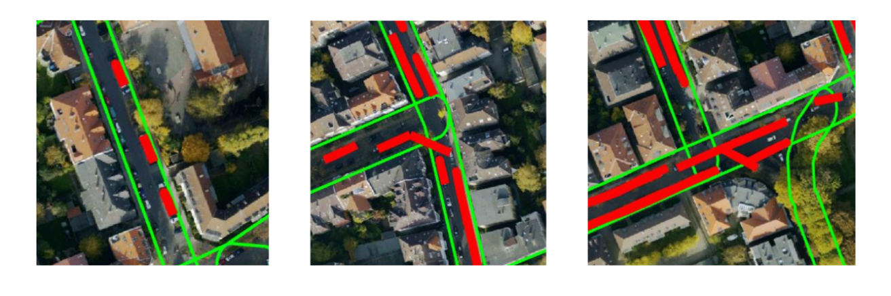
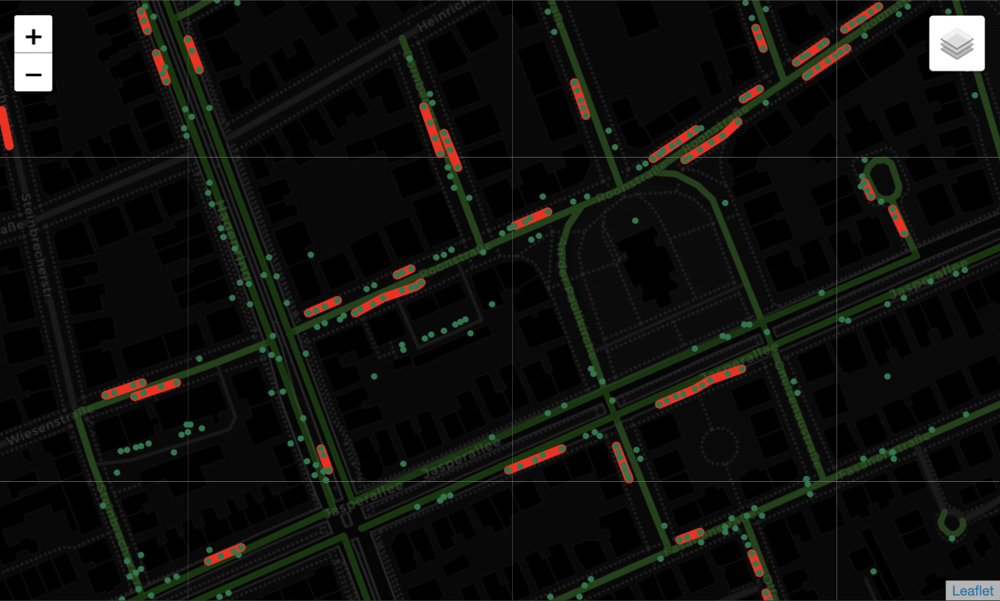
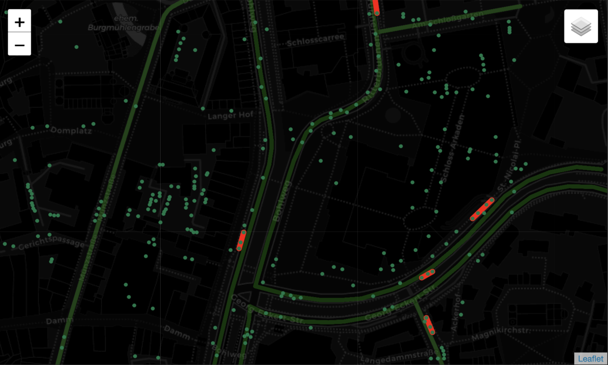
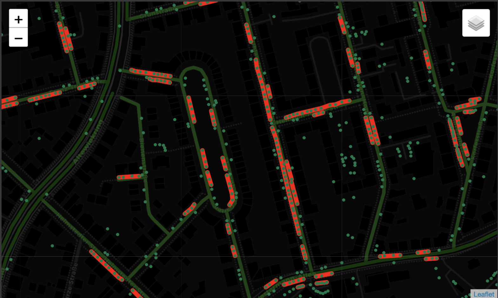
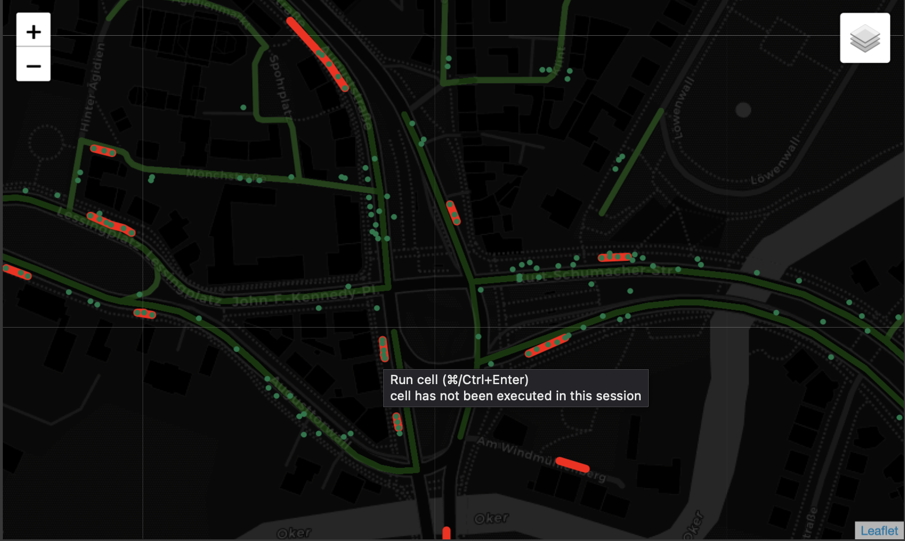

# parking_space_detection
The task was to identify on-street parking areas in Braunschweig in the form of lines parallel to the street.

The data given were latitude and longitude of cars that were extracted from satellite images. The aim was to find line-like clusters of cars that represent on-street parking space. Therefore, off-street parked vehicles as well as vehicles that are driving had to be removed.

On the left of the example image we see bounding boxes of cars that were extracted from satellite images. The data given were the latitude and longitude coordinates of the center of each car's bounding box. On the right is an example result, where line clusters were identified that represent available on-street parking space.

Typical errors that should be avoided are too short lines (good is to have at least 3 vehicles in order to have a valid parking area), lines crossing the street or double assignments of vehicles to multiple parking areas
## Approach:
1. Import Packages & Load Data
2. Exploration & Feature Engineering
	* 	Find closest street for each vehicle
	*  Delete offsite parked cars based on distance to closest street
3. Parking Area Extraction
	* 	A set of vehicles was merged into one parking area, if the following conditions are fulfilled:

		* A parking area is formed by connecting vehicle center points (vertices) through edges
		* A parking area must be formed by at least three vehicle vertices
		* The edge length between two vertices is < 12 meters (twice the avg. parking spot length)
		* The absolute mean angle between the parking area and the main direction angle of the corresponding street must not be larger than 6 Degrees
		* 
1. 	Visualization of the results
 
## Results:
##### Area from example.img :

The result is different from the example.png, but mainly because the obervations took place at two different points in time. For example, Fasanenstraße was a lot more empty at the time of obervation of this dataset, then at the time when the example picture was taken. Anyhow, many of the detected parking areas can also be found in the example.png.

##### Old town:

In the old town of Braunschweig only few parking areas were detected. The reason for this seems to be, that the city network data of Braunschweig did not map most of the small streets there. Vehicles that were located in that area were therefore categorized as too far from any road and removed. This also explains the high percentage of vehicles classified as off road. A more accurate street mapping would eliminate the error.

##### Residential:

In the residential area parking area seems to be easily and accurately detectable with the applied algorithm. Though, looking at the south-east of the selected window, we can again see where the streets aren't accurately mapped and therefore many cars have been removed because they fell into the "offstreet"-category

##### Highway:
